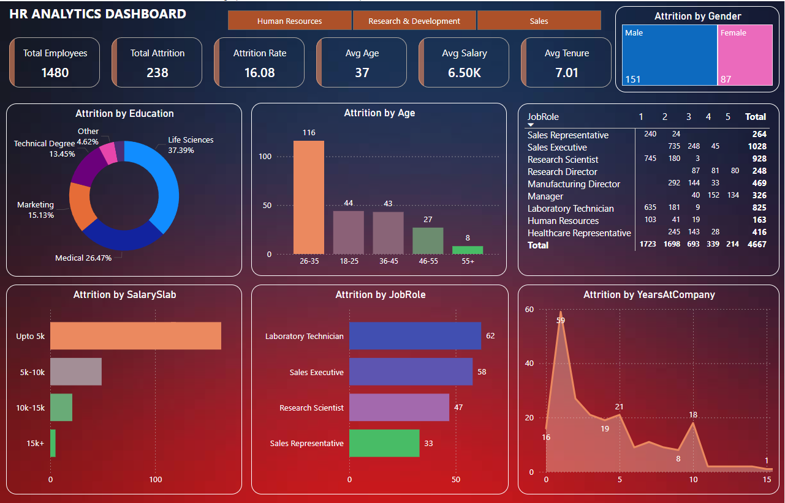

# 💼 HR Analytics Dashboard (Power BI)

This project is a comprehensive HR analytics dashboard built in **Power BI**, focusing on **employee attrition analysis** using a structured HR dataset. It enables HR teams to monitor workforce dynamics, identify at-risk employees, and uncover factors influencing attrition.

---

## 📌 Project Overview

The **HR Analytics Dashboard** is an interactive and visual data tool designed to help organizations understand, monitor, and reduce employee attrition. It focuses on key HR indicators such as employee satisfaction, salary distribution, performance, job roles, and work-life balance.  

With the help of visual insights, HR teams can:
- Spot patterns in employee turnover
- Evaluate employee engagement
- Detect problem areas across departments, roles, or demographics
- Make informed decisions about retention strategies

---

## 🎯 Project Goals

1. **Analyze Attrition Trends**  
   Understand how attrition varies by age, department, job role, salary slab, education level, and tenure.

2. **Identify High-Risk Groups**  
   Detect specific demographics or roles (e.g., younger employees or lab technicians) that are more prone to leaving.

3. **Evaluate the Impact of Work Conditions**  
   Explore how overtime, job satisfaction, training, and work-life balance influence employee retention.

4. **Support Strategic Decision-Making**  
   Provide actionable insights that help reduce turnover and improve employee engagement and satisfaction.

---

## 📊 Key Features

- 📌 **KPIs:**
  - Total Employees
  - Total Attrition
  - Attrition Rate (%)
  - Average Age
  - Average Salary
  - Average Years at Company

- 🔍 **Interactive Visuals:**
  - Attrition by Age Group
  - Attrition by Salary Slab
  - Attrition by Gender
  - Attrition by Job Role and Job Level
  - Attrition by Education Field
  - Year-wise Attrition Trends
  - Departmental Views (HR, Sales, R&D)

- 📎 **Filters/Slicers:**
  - Department
  - Gender
  - Salary Slab
  - Education Field
  - OverTime

---

## 🛠️ Technologies Used

- **Power BI Desktop**
- **DAX (Data Analysis Expressions)**
- **Power Query**

---

## 🚀 How to Use

1. Clone this repository or download the `.pbix` file.
2. Open it in Power BI Desktop.
3. Explore the visuals, filter by department or gender, and gain insights.
4. Use slicers and charts interactively to drill down into attrition patterns.

---

## 📁 Dataset & Files

| File | Description |
|------|-------------|
| `dashbaord/HR_Analytics_Dashboard.pbix` | Power BI Dashboard file |
| `dataset/HR_Employee_Data.csv` | HR dataset used in the dashboard |
| `images/Capture.PNG` | Preview of the final dashboard |

---

## 📷 Dashboard Preview

---

---

## 📈 Insights & Analysis

Based on the HR analytics dashboard, we performed an in-depth analysis of employee attrition trends across various dimensions like age, department, salary, job role, and work conditions. Here are the key insights:

### 🔹 1. Attrition Rate
- The overall attrition rate is **16.2%** (238 employees out of 1470 left).
- This rate is significant and suggests a need for focused retention strategies.

### 🔹 2. Age-wise Attrition
- Employees in the **26–35 age group** have the highest attrition.
- Indicates mid-career employees are more likely to switch jobs, possibly for better growth opportunities.

### 🔹 3. Salary Slab vs Attrition
- A **majority of attrition (163 cases)** occurs in the **"Upto 5k" salary slab**.
- Suggests that **low salary** is a strong contributor to employee turnover.

### 🔹 4. Attrition by Department & Job Role
- **Laboratory Technicians** and **Sales Executives** show the highest attrition.
- This could be due to high workload, limited growth, or external demand for similar roles.

### 🔹 5. Years at Company
- Most attrition happens within the **first year** of joining.
- Indicates potential issues with onboarding experience or role fit.

### 🔹 6. Education Field & Gender
- Attrition is higher among employees with **Life Sciences** and **Medical** backgrounds.
- Gender-wise attrition is slightly higher in **male employees**, though not significantly.

### 🔹 7. Overtime & Job Satisfaction
- Employees who frequently work **overtime** show higher attrition.
- Low **job satisfaction** and **work-life balance** ratings are also correlated with higher turnover.

---

## 📌 Conclusion

The analysis highlights a clear pattern: younger employees with lower pay, working overtime, and in specific job roles are more likely to leave. Strategic focus on **improving compensation, early engagement, career development, and work-life balance** can significantly reduce attrition and improve retention.

